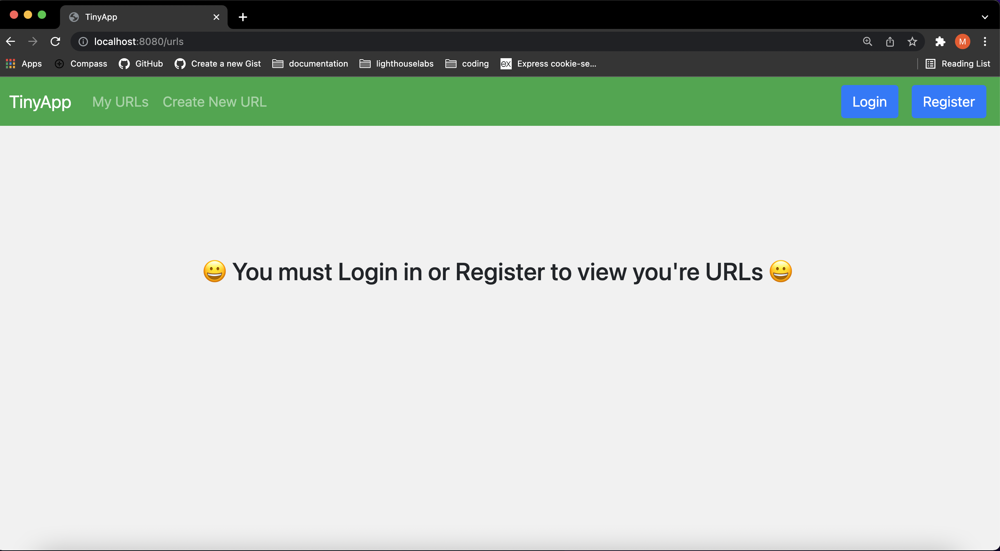
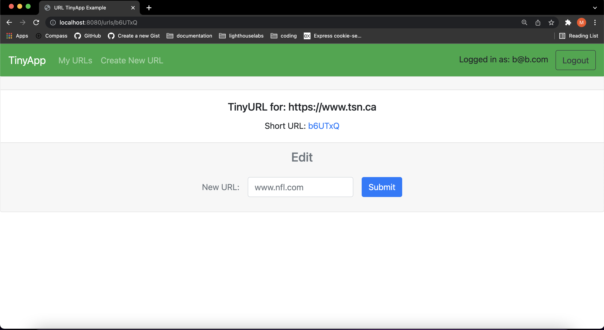

# TinyApp Project

TinyApp is a full stack web application built with Node and Express that allows users to shorten long URLs.

## Final Product
Main page saying to log in first

Page where you can edit your url

Page if there is a error

Page when logged in

## Dependencies

- Node.js
- Express
- EJS
- bcrypt
- body-parser
- cookie-session

## Getting Started

- Install all dependencies (using the `npm install` command).
- Run the development web server using the `node express_server.js` command.
- Register as a new user to start
- You can log in with one existing user hardcoded with email: b@b.com password: mike.